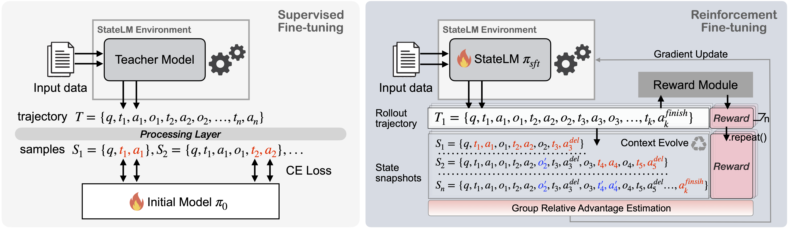

## StateLM Training Pipeline (Quick Start, verl 0.6.0)

StateLM agentic RL pipeline teaches language models to **manage their own context** using tools (e.g., deleting old messages, writing notes, reading documents) while training with GRPO/PPO-style objectives.



## Quick Start

The standard training recipe has 3 main steps:

### 1. Set up the environment

- **Clone the repository**:

```bash
git clone https://github.com/xyliu-cs/agentic_verl.git
cd agentic_verl
```

- **Create and activate a Conda environment**:

  1. **Recommended (official installation)**: follow the official `verl v0.6.0` installation instructions from the main project docs.
  2. **Or, use our example environment** using the provided `agent_rl_env.yml`:

```bash
conda env create -f agent_rl_env.yml
conda activate agent_rl
```

After the environment is ready, make sure `verl==0.6.0`, Ray, WandB, and your serving stack (vLLM) are available in the environment. Adjust versions as needed for your cluster/CUDA setup.

- **Set required environment variables** (commonly needed for training and logging):

```bash
export HUGGING_FACE_HUB_TOKEN=your_hf_token
export WANDB_API_KEY=your_wandb_key
export HTTPS_PROXY=...
export HTTP_PROXY=...
export NO_PROXY=...
```

### 2. Prepare and save training data

Use `examples/data_preprocess/generate_data.sh` to download and prepare LongBench-v2 RL data in parquet format.

Edit the script `examples/data_preprocess/generate_data.sh` to point to your desired local directory and dataset name and run it.

After this step, you should have data like in the specified path:

- `/path/to/train.parquet`
- `/path/to/val.parquet`


### 3. Configure and launch training

The example scripts are provided in `examples/sglang_multiturn`. Configure the scripts according to your experiment settings and run them.

First launch the ray cluster:
```bash
# On the head node
ray start --head --num-cpus=16 --dashboard-port=8265 --dashboard-host=0.0.0.0 --dashboard-agent-listen-port=59323
# On the worker node
ray start  --address=head_node_ip:6379 --node-ip-address=worker_node_ip --num-gpus=8
```

Then launch training at the head node:
```bash
bash examples/sglang_multiturn/run_qwen3-14b_statelm_longbenchv2_rl.sh
```

After training, convert the model to the huggingface format:
```bash
sh scripts/run_ckpt_merger.sh
```

---
# Appendix
## Key Execution Flow

### 1. Initialization
```
run_*.sh → main_ppo.py → TaskRunner → RayPPOTrainer → AgentLoopManager
```

### 2. Training Loop
```
fit() → for each batch:
  ├─> generate_sequences()      # Rollout
  ├─> compute_reward()           # Rewards
  ├─> compute_log_prob()         # Log probs
  ├─> compute_values()           # Values
  ├─> compute_advantage()        # Advantages
  ├─> update_critic()            # Critic update
  └─> update_actor()             # Actor update
```

### 3. StateLM Rollout (Sequence Generation)
```
AgentLoopManager.generate_sequences()
  └─> AgentLoopWorker.generate_sequences()
       └─> _run_agent_loop()
            └─> StatelmToolAgentLoop.run()
                 └─> STATE MACHINE:
                      PENDING → GENERATING → PROCESSING_TOOLS → (loop or TERMINATED)
                      ↑                           ↓
                      └───── deleteContext ───────┘ (creates snapshot & re-renders)
```

## Important Patterns

### 1. Multi-Trajectory Output (StateLM)
When `deleteContext` is used:
```python
MultiTrajectoryAgentLoopOutput(
    trajectories=[
        AgentLoopOutput(...),  # Snapshot 1
        AgentLoopOutput(...),  # Snapshot 2
        AgentLoopOutput(...),  # Final trajectory
    ]
)
```

### 2. Response Mask Pattern
```
Multi-turn conversation:
responses:     |<- LLM ->|<- tool ->|<- LLM ->|<- pad ->|
response_mask: |1,1,1,...|0,0,...,0|1,1,...,1|0,...,0  |
               └─────────┴─────────┴─────────┴─────────┘
                  Learn     Skip     Learn     Skip
```

### 3. StateLM Snapshot Pattern
```
Before deleteContext (saved as snapshot):
response_mask: [1, 1, 1, 1, 1, 1, 1, 1]  # All tokens for learning

After deleteContext (new trajectory):
response_mask: []  # Reset, only new generation is learned
prompt_ids: re-tokenized with deleted messages replaced by stubs
```
